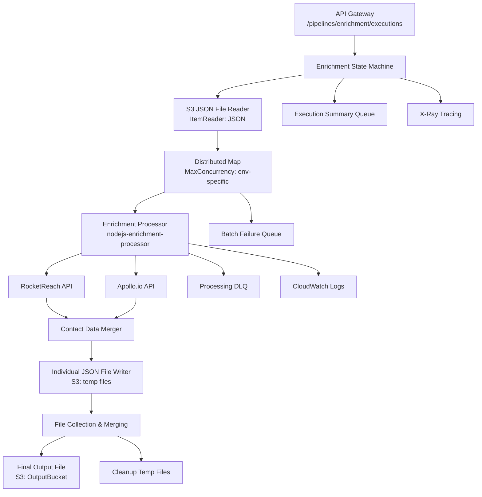

# implement-enrichment-pipeline - Task 16

Execute task 16 for the implement-enrichment-pipeline specification.

## Task Description
Create enrichment processor unit tests

## Code Reuse
**Leverage existing code**: existing test patterns from other functions

## Requirements Reference
**Requirements**: 2.1, 2.2, 3.1

## Usage
```
/Task:16-implement-enrichment-pipeline
```

## Instructions

Execute with @spec-task-executor agent the following task: "Create enrichment processor unit tests"

```
Use the @spec-task-executor agent to implement task 16: "Create enrichment processor unit tests" for the implement-enrichment-pipeline specification and include all the below context.

# Steering Context
## Steering Documents Context (Pre-loaded)

### Product Context
# Product Vision & Requirements

## Product Overview

A serverless data processing platform built on AWS SAM that provides scalable, multi-pipeline data processing capabilities for ingesting, validating, standardizing, and processing both CSV and JSON data files.

## Core Problem & Solution

**Problem**: Organizations need to process diverse data formats through different specialized workflows while maintaining consistency, quality, and scalability.

**Solution**: A platform that provides multiple specialized pipelines for different data processing needs, with shared infrastructure and standardized patterns.

## Target Users & Use Cases

### Primary Users
- **Data Engineers**: Building and maintaining data processing workflows
- **Data Scientists**: Processing research data through specialized pipelines
- **Business Analysts**: Ingesting and standardizing business data
- **DevOps Teams**: Managing multi-environment deployments

### Use Cases
- **Data Ingestion**: Processing incoming CSV/JSON files with validation and standardization
- **Data Enrichment**: Adding metadata, quality scores, and business logic transformations
- **Research Processing**: Specialized workflows for research data analysis
- **Data Quality**: Validation, cleansing, and quality scoring
- **Multi-format Support**: Handling both structured CSV and semi-structured JSON data

## Pipeline Types & Capabilities

### Current Pipelines
1. **Ingestion Pipeline**
   - CSV/JSON format validation
   - OpenAI-powered data standardization
   - Schema mapping and transformation
   - Final processing and storage

### In Development
2. **Enrichment Pipeline**
   - Data augmentation with metadata
   - Quality scoring and validation
   - Business rule application
   - External reference data lookups

### Planned
3. **Research Pipeline**
   - Research-specific data processing
   - Specialized analytics workflows
   - Custom transformation logic

## Key Features

### Data Processing
- Multi-format support (CSV, JSON)
- Intelligent data standardization using OpenAI
- Configurable validation rules
- Distributed processing with AWS Step Functions
- Error handling with dead letter queues

### Infrastructure
- Multi-environment support (dev/staging/production)
- Auto-scaling Lambda functions
- Environment-specific resource configurations
- API Gateway endpoints for pipeline triggers
- Comprehensive monitoring and logging

### Extensibility
- Modular pipeline architecture
- Configurable processing rules
- Support for external API integrations
- Pluggable enrichment capabilities

## Business Objectives

### Performance Goals
- Process large datasets efficiently with distributed processing
- Maintain < 20% performance overhead for enrichment features
- Support concurrent processing with environment-specific limits

### Quality Metrics
- Error rates below 1% for pipeline executions
- High data quality scores through validation and enrichment
- Comprehensive audit trails for all processed data

### Operational Goals
- Zero-downtime deployments across environments
- Automated monitoring and alerting
- Cost-effective serverless architecture
- Scalable to handle varying workload demands

## Success Criteria

### Technical Success
- Pipeline successfully processes both CSV and JSON data
- Multi-pipeline architecture supports different workflow types
- Environment configurations properly isolate dev/staging/production
- Monitoring provides full visibility into processing status

### Business Success
- Reduced time-to-process for data ingestion workflows
- Improved data quality through standardization and enrichment
- Scalable platform supporting multiple use cases
- Reduced operational overhead through serverless architecture

## Future Vision

- Machine learning-enhanced data processing
- Real-time streaming data support
- Advanced rule engines with GUI interfaces
- Integration with additional data sources and formats
- Custom plugin architecture for specialized processing needs

---

### Technology Context
# Technology Stack & Architecture

## Infrastructure & Cloud Services

### AWS Serverless Architecture
- **AWS SAM (Serverless Application Model)**: Infrastructure as Code with CloudFormation
- **AWS Lambda**: Node.js 20.x runtime with ES module support
- **AWS Step Functions**: Pipeline orchestration with distributed processing
- **Amazon S3**: Input/output data storage with multi-environment buckets
- **Amazon API Gateway**: RESTful endpoints for pipeline triggers
- **Amazon SQS**: Dead letter queues for error handling and batch failures
- **Amazon CloudWatch**: Logging, monitoring, and metrics
- **AWS X-Ray**: Distributed tracing for performance analysis

### Deployment & Configuration
- **Region**: ap-southeast-1 (Asia Pacific - Singapore)
- **Multi-Environment Support**: dev, staging, production with different resource allocations
- **SAM Configuration**: `samconfig.toml` with environment-specific settings
- **Automated Deployment**: Shell scripts for environment-specific deployments

## Runtime & Development Stack

### Node.js Environment
- **Runtime**: Node.js 20.x
- **Module System**: ES modules (type: "module")
- **Architecture**: x86_64
- **Source Maps**: Enabled for debugging
- **Environment Variables**: Secure handling with NoEcho parameters

### Key Dependencies
- **OpenAI API**: Data standardization and intelligent processing
- **AWS SDK**: Native integration with AWS services (implied through SAM)
- **Native AWS Lambda Runtime**: No additional framework dependencies

## Architecture Patterns

### Serverless Microservices
- **Function-per-Purpose**: Individual Lambda functions for each processing stage
- **Stateless Design**: No persistent connections or state between invocations
- **Event-Driven**: Step Functions coordinate execution flow
- **Distributed Processing**: Parallel execution with configurable concurrency

### Data Flow Architecture
```
API Gateway → Step Functions → [Validation → Standardization → Mapping → Processing → Merging]
                    ↓
               S3 Storage + SQS Error Handling
```

### Multi-Pipeline Support
- **Modular Design**: Each pipeline type as separate Step Function state machine
- **Shared Infrastructure**: Common Lambda functions reusable across pipelines
- **Pipeline-Specific Logic**: Dedicated functions for specialized processing

## Resource Configuration

### Environment-Specific Settings
| Resource | Development | Staging | Production |
|----------|------------|---------|------------|
| Lambda Memory | 256MB | 512MB | 1024MB |
| Lambda Timeout | 60s | 120s | 300s |
| Log Retention | 7 days | 14 days | 30 days |
| Step Functions Concurrency | 100 | 500 | 1000 |

### Storage & Naming
- **S3 Buckets**: `{basename}-{environment}-{account-id}` pattern
- **Stack Names**: `sam-data-pipeline-{environment}`
- **API Stages**: Environment-specific stage names

## Security & Compliance

### IAM Security
- **Least Privilege**: Functions have minimal required permissions
- **Role-Based Access**: Separate IAM roles per function
- **Resource-Level Permissions**: Fine-grained S3 and Lambda access
- **Cross-Service Policies**: Secure Step Functions → Lambda invocation

### Data Security
- **Environment Variable Encryption**: Sensitive data encrypted at rest
- **API Security**: CORS configuration for secure cross-origin requests
- **Network Isolation**: Can be configured for VPC deployment
- **Audit Trails**: Complete execution logging and tracing

## Performance & Scalability

### Concurrent Processing
- **Distributed Maps**: Step Functions handle large dataset processing
- **Batch Processing**: Configurable batch sizes for efficiency
- **Auto-scaling**: Lambda automatic scaling based on demand
- **Timeout Management**: Environment-specific timeout configurations

### Data Processing
- **Stream Processing**: ItemReader for efficient S3 CSV/JSON processing
- **Error Tolerance**: Configurable failure thresholds
- **Memory Optimization**: Function-specific memory allocations
- **Cost Optimization**: Right-sized resources per environment

## External Integrations

### OpenAI Integration
- **API**: GPT models for data standardization
- **Authentication**: Secure API key management
- **Error Handling**: Circuit breaker patterns for external API failures
- **Rate Limiting**: Configurable retry logic

### Future Integration Points
- **Geolocation APIs**: For address enhancement
- **External Reference Data**: Third-party data enrichment
- **Machine Learning**: Custom ML model integration
- **Real-time APIs**: Streaming data support

## Monitoring & Observability

### Logging & Metrics
- **CloudWatch Logs**: Centralized logging with retention policies
- **Custom Metrics**: Business-specific metrics tracking
- **X-Ray Tracing**: End-to-end request tracing
- **Dead Letter Queues**: Error message aggregation

### Deployment Monitoring
- **CloudFormation Events**: Stack deployment tracking
- **Lambda Function Metrics**: Performance and error monitoring
- **Step Function Execution**: Visual workflow monitoring
- **S3 Metrics**: Data processing volume tracking

## Development & Testing

### Local Development
- **SAM CLI**: Local function and API testing
- **Local Step Functions**: Workflow testing
- **Event Simulation**: Test event payloads for development

### Testing Strategy
- **Unit Tests**: Individual function testing
- **Integration Tests**: Cross-service workflow testing
- **Performance Testing**: Load testing and optimization
- **Multi-Environment Testing**: Validation across deployment tiers

## Technical Constraints

### AWS Limits
- **Lambda**: 15-minute execution limit
- **Step Functions**: 1-year execution limit
- **API Gateway**: Request/response size limits
- **S3**: Object size and throughput considerations

### Performance Requirements
- **Latency**: Sub-second API response for triggers
- **Throughput**: Support for large CSV/JSON file processing
- **Availability**: 99.9% uptime target
- **Scalability**: Handle varying workload demands

## Technical Decisions

### Why Serverless
- **Cost Efficiency**: Pay-per-use model
- **Auto-scaling**: No capacity planning required
- **Reduced Operations**: Minimal infrastructure management
- **High Availability**: Built-in fault tolerance

### Why Step Functions
- **Visual Workflows**: Easy to understand and maintain
- **Error Handling**: Built-in retry and error handling
- **Distributed Processing**: Native support for parallel execution
- **State Management**: Reliable workflow orchestration

---

### Structure Context
# Project Structure & Conventions

## Directory Organization

### Root Level Structure
```
├── functions/                          # Lambda function source code
├── statemachine/                       # Step Functions definitions
├── events/                             # Test event payloads
├── tests/                              # Unit and integration tests
├── scripts/                            # Deployment and utility scripts
├── docs/                               # Additional documentation
├── template.yaml                       # SAM template (Infrastructure as Code)
├── samconfig.toml                      # SAM deployment configurations
├── makefile                            # Build automation
└── README.md                           # Project documentation
```

### Function Organization
```
functions/
├── nodejs-validate-raw-valid-format/   # CSV/JSON format validation
├── nodejs-standardization/             # OpenAI data standardization  
├── nodejs-mapping-raw-valid-input/     # Schema mapping
├── nodejs-process-standardized-data/   # Final data processing
├── nodejs-merge-csv-data/              # Result aggregation
└── [future-pipeline-functions]/        # Additional pipeline functions
```

### State Machine Organization
```
statemachine/
├── ingestion_pipeline.asl.json         # Main ingestion pipeline
├── test/                               # State machine test definitions
└── [future-pipelines]/                 # Additional pipeline state machines
```

## Naming Conventions

### Resource Naming Patterns
- **Lambda Functions**: `{language}-{purpose}-{type}` (e.g., `nodejs-validate-raw-valid-format`)
- **S3 Buckets**: `{basename}-{environment}-{account-id}` (e.g., `data-pipeline-input-dev-123456789012`)
- **Stack Names**: `sam-data-pipeline-{environment}` (e.g., `sam-data-pipeline-production`)
- **API Stages**: `{environment}` (e.g., `dev`, `staging`, `production`)

### Function Structure Pattern
```
functions/function-name/
├── src/
│   ├── index.js/.mjs                   # Main handler code
│   └── [additional-modules].js/.mjs    # Supporting modules
└── package.json                        # Dependencies and metadata
```

### Code Naming
- **Files**: Use kebab-case for directories and files
- **Functions**: Use camelCase for JavaScript functions
- **Variables**: Use camelCase for local variables
- **Constants**: Use UPPER_SNAKE_CASE for constants
- **Environment Variables**: Use UPPER_SNAKE_CASE

## File Organization Patterns

### Lambda Function Standards
```javascript
// Standard handler pattern
export const handler = async (event, context) => {
    // Function implementation
};
```

### Package.json Structure
```json
{
  "name": "function-name",
  "version": "1.0.0",
  "type": "module",
  "dependencies": {
    // Production dependencies only
  }
}
```

### Environment Configuration
- **Development**: Optimized for rapid iteration and debugging
- **Staging**: Production-like for integration testing
- **Production**: Optimized for performance and reliability

## Infrastructure as Code Patterns

### SAM Template Structure
```yaml
AWSTemplateFormatVersion: '2010-09-09'
Transform: AWS::Serverless-2016-10-31
Description: > 
  Pipeline-specific description

Parameters:        # Environment and configuration parameters
Mappings:         # Environment-specific resource configurations  
Globals:          # Shared function configurations
Resources:        # AWS resources (Functions, APIs, Storage)
Outputs:          # Stack outputs for cross-stack references
```

### Resource Definition Pattern
```yaml
FunctionName:
  Type: AWS::Serverless::Function
  Properties:
    CodeUri: functions/function-directory/
    Handler: src/index.handler
    Description: 'Function purpose description'
    Policies: [Required IAM policies]
    Environment:
      Variables: [Function-specific environment variables]
    DeadLetterQueue:
      Type: SQS
      TargetArn: !GetAtt ProcessingDeadLetterQueue.Arn
```

## Deployment Patterns

### Environment Configuration Structure
```toml
[{env}.global.parameters]
stack_name = "sam-data-pipeline-{env}"
region = "ap-southeast-1"

[{env}.deploy.parameters]
capabilities = "CAPABILITY_IAM CAPABILITY_NAMED_IAM"
confirm_changeset = true
resolve_s3 = true
```

### Script Organization
```
scripts/
├── deploy.sh                          # Main deployment script
├── deploy-{environment}.sh             # Environment-specific deployment
├── cleanup.sh                         # Environment cleanup
└── manage-environments.sh              # Environment management utilities
```

## Testing Organization

### Test Structure
```
tests/
├── unit/                               # Unit tests for individual functions
│   ├── function-name/
│   │   └── test-handler.js
├── integration/                        # Integration tests for workflows
│   ├── pipeline-tests/
│   │   └── ingestion-pipeline.test.js
└── fixtures/                           # Test data and fixtures
```

### Event Payload Organization
```
events/
├── api-gateway-event.json             # API Gateway trigger events
├── test-event.json                    # General test events
└── pipeline-specific/                 # Pipeline-specific test events
```

## Error Handling Patterns

### Dead Letter Queue Integration
- All functions include DLQ configuration
- Standardized error message format
- Environment-specific retention policies

### Error Response Format
```javascript
{
  "errorType": "ValidationError",
  "errorMessage": "Descriptive error message",
  "stackTrace": [...],
  "timestamp": "ISO-8601-timestamp",
  "requestId": "lambda-request-id"
}
```

## Logging Patterns

### Structured Logging
```javascript
console.log('Processing batch raw Data:', event, context);
console.error('Error processing data:', error);
console.info('Successfully processed:', resultSummary);
```

### Log Retention
- **Development**: 7 days
- **Staging**: 14 days  
- **Production**: 30 days

## Development Workflow

### Local Development
1. Use SAM CLI for local function testing
2. Test individual functions with event payloads
3. Validate SAM template before deployment
4. Run integration tests locally when possible

### Code Quality Standards
- ES modules for all new code
- Consistent error handling patterns
- Environment variable validation
- Input parameter validation
- Comprehensive logging

### Deployment Workflow
1. Validate template: `sam validate`
2. Build application: `sam build`
3. Deploy to target environment: `./scripts/deploy.sh {env}`
4. Verify deployment with test execution
5. Monitor logs and metrics post-deployment

## Multi-Pipeline Support

### Adding New Pipelines
1. **Create State Machine**: Add new ASL definition in `statemachine/`
2. **Add Functions**: Create pipeline-specific functions in `functions/`
3. **Update Template**: Add resources to `template.yaml`
4. **Configure Deployment**: Update scripts and configurations
5. **Add Tests**: Create pipeline-specific test suites

### Shared Resource Patterns
- Reusable functions across pipelines where appropriate
- Common error handling and monitoring
- Standardized IAM policies and roles
- Consistent naming and tagging

## Configuration Management

### Environment Variables
- Secure handling with SAM parameter encryption
- Environment-specific values via mappings
- No hardcoded sensitive data in code
- Validation of required environment variables

### Parameter Management
- Template parameters for deployment-time configuration
- Environment mappings for resource sizing
- Default values with override capabilities
- Clear parameter documentation

## Documentation Standards

### Code Documentation
- Function-level JSDoc comments for complex logic
- README files for each major component
- Inline comments for business logic
- API documentation for external interfaces

### Architecture Documentation
- Keep diagrams and documentation current
- Document deployment procedures
- Maintain troubleshooting guides
- Update documentation with each major change

**Note**: Steering documents have been pre-loaded. Do not use get-content to fetch them again.

# Specification Context
## Specification Context (Pre-loaded): implement-enrichment-pipeline

### Requirements
# Requirements Document

## Introduction

The enrichment pipeline feature enhances the existing SAM data processing platform by providing contact data enrichment capabilities through third-party APIs (RocketReach and Apollo.io). This pipeline processes JSON files containing contact data from the ingestion pipeline output, enriches the data with additional emails and phone numbers via parallel API calls, and outputs consolidated enriched data.

The enrichment pipeline extends the platform's multi-pipeline architecture with a specialized workflow for contact data enhancement, maintaining the existing distributed processing patterns and infrastructure.

## Alignment with Product Vision

This feature directly supports several key product objectives outlined in the product vision:

- **Data Enrichment Use Case**: Implements contact data enrichment through third-party API integration as identified in the core use cases
- **Multi-Pipeline Architecture**: Extends the platform's multi-pipeline capabilities with a specialized contact enrichment workflow
- **Multi-format Support**: Processes JSON data from ingestion pipeline output using existing OUTPUT_DATA_STRUCTURE format
- **Performance Goals**: Maintains efficient processing through parallel API calls and distributed processing patterns
- **Scalability**: Leverages the existing serverless architecture and Step Functions distributed map for auto-scaling
- **External API Integration**: Integrates RocketReach and Apollo.io APIs for contact data enhancement

## Requirements

### Requirement 1: JSON File Processing with Distributed Map

**User Story:** As a data engineer, I want the enrichment pipeline to process JSON files using the same distributed map pattern as the ingestion pipeline, so that contact data can be enriched efficiently in parallel batches.

#### Acceptance Criteria

1. WHEN a JSON file is provided as input THEN the system SHALL use Step Functions distributed map to process the file in batches
2. WHEN processing begins THEN the system SHALL read JSON data that conforms to the OUTPUT_DATA_STRUCTURE format from the ingestion pipeline
3. WHEN batching records THEN the system SHALL process up to 15 items per batch following existing patterns
4. IF the input file is invalid or missing THEN the system SHALL log the error and send failure information to the dead letter queue
5. WHEN file processing completes THEN the system SHALL generate execution summaries similar to the ingestion pipeline

### Requirement 2: Third-Party API Integration

**User Story:** As a sales team member, I want contact records to be enriched with additional email addresses and phone numbers from RocketReach and Apollo.io, so that I have more comprehensive contact information for outreach.

#### Acceptance Criteria

1. WHEN processing each contact record THEN the system SHALL make parallel API calls to both RocketReach and Apollo.io APIs
2. WHEN API calls are successful THEN the system SHALL extract additional email addresses and phone numbers from the responses
3. WHEN adding new contact information THEN the system SHALL skip duplicate emails and phone numbers already present in the record
4. IF either API is unavailable or rate-limited THEN the system SHALL continue processing with available data and log the limitation
5. WHEN both APIs fail THEN the system SHALL return the original record unchanged with appropriate error flags

### Requirement 3: Contact Data Enrichment and Deduplication

**User Story:** As a data quality manager, I want enriched contact data to maintain the existing data structure while adding new unique contact information, so that downstream systems receive clean, comprehensive datasets.

#### Acceptance Criteria

1. WHEN new emails are found THEN the system SHALL add them to the emails array with appropriate priority values
2. WHEN new phone numbers are found THEN the system SHALL add them to the phones array with appropriate priority values
3. WHEN checking for duplicates THEN the system SHALL compare email addresses and phone numbers case-insensitively
4. WHEN adding new contact information THEN the system SHALL maintain the existing OUTPUT_DATA_STRUCTURE format
5. WHEN enrichment is complete THEN the system SHALL preserve all original fields (campaign_id, commit_id, name, company, etc.)

### Requirement 4: Individual Record Processing and File Generation

**User Story:** As a system administrator, I want each enriched record to be written to individual JSON files during processing, so that the system can handle large datasets efficiently and recover from partial failures.

#### Acceptance Criteria

1. WHEN each record is enriched THEN the system SHALL write the result to a small individual JSON file in S3
2. WHEN writing individual files THEN the system SHALL use a structured naming convention with batch and record identifiers
3. WHEN individual file writes fail THEN the system SHALL retry with exponential backoff
4. IF individual file writes continue to fail THEN the system SHALL send the record to the dead letter queue
5. WHEN all records in a batch are processed THEN the system SHALL track the individual file locations for merging

### Requirement 5: File Merging and Cleanup

**User Story:** As a data consumer, I want all enriched records to be consolidated into a single JSON file with temporary files cleaned up, so that I can easily access the complete enriched dataset.

#### Acceptance Criteria

1. WHEN all individual record files are created THEN the system SHALL collect and merge them into a single large JSON file
2. WHEN merging files THEN the system SHALL maintain the array structure with all enriched records
3. WHEN the merged file is created THEN the system SHALL write it to the designated output bucket
4. WHEN merging is complete THEN the system SHALL clean up all temporary individual JSON files
5. IF cleanup fails THEN the system SHALL log warnings but not fail the overall process

### Requirement 6: API Gateway Integration

**User Story:** As an API consumer, I want to trigger the enrichment pipeline through the same API Gateway as the ingestion pipeline but with a different endpoint path, so that I have a consistent interface for all pipeline operations.

#### Acceptance Criteria

1. WHEN the enrichment pipeline is deployed THEN the system SHALL create a new API Gateway path at `/pipelines/enrichment/executions`
2. WHEN the API endpoint is called THEN the system SHALL accept the same input format as the ingestion pipeline (bucket, key, campaign_id)
3. WHEN the API receives a request THEN the system SHALL trigger the enrichment Step Functions state machine
4. WHEN the pipeline execution starts THEN the system SHALL return execution details including executionArn and startDate
5. WHEN API calls fail THEN the system SHALL return appropriate HTTP status codes and error messages

### Requirement 7: Error Handling and Monitoring

**User Story:** As a DevOps engineer, I want the enrichment pipeline to use the same error handling and monitoring patterns as existing pipelines, so that I can maintain operational consistency across all systems.

#### Acceptance Criteria

1. WHEN processing errors occur THEN the system SHALL send failure messages to the existing batch failure SQS queue
2. WHEN individual records fail THEN the system SHALL use the existing processing dead letter queue pattern
3. WHEN the pipeline completes THEN the system SHALL send execution summaries to the summary queue
4. WHEN errors are logged THEN the system SHALL include sufficient context for troubleshooting (campaign_id, commit_id, error details)
5. WHEN monitoring the pipeline THEN the system SHALL integrate with existing CloudWatch logs and X-Ray tracing

## Non-Functional Requirements

### Performance

- RocketReach and Apollo.io API calls SHALL be made in parallel to minimize processing time
- Lambda function SHALL process batches of 15 records within environment-specific timeouts (dev: 60s, staging: 120s, production: 300s)
- System SHALL support concurrent processing up to environment-specific limits (dev: 100, staging: 500, production: 1000)
- API rate limiting SHALL be implemented to respect third-party service limits
- Memory allocation SHALL be configurable per environment (dev: 512MB, staging: 512MB, production: 1024MB)

### Security

- RocketReach and Apollo.io API keys SHALL be stored using AWS Systems Manager Parameter Store with encryption
- All external API calls SHALL use HTTPS/TLS for secure communication
- Temporary JSON files in S3 SHALL use server-side encryption
- IAM roles SHALL follow least privilege principle with minimal required permissions for S3 and external API access
- API keys SHALL not be logged or exposed in CloudWatch logs

### Reliability

- System SHALL achieve 99.9% availability matching existing pipeline components
- External API failures SHALL not cause the entire pipeline to fail
- Individual record processing failures SHALL not affect other records in the batch
- Dead letter queue integration SHALL capture and store failed enrichment attempts
- Retry logic SHALL be implemented for transient API and S3 failures

### Usability

- API endpoint SHALL follow the same patterns as existing ingestion pipeline
- Error messages SHALL be descriptive and include contact information context for troubleshooting
- CloudWatch logs SHALL provide visibility into API call success rates and response times
- System SHALL maintain full compatibility with existing OUTPUT_DATA_STRUCTURE format
- Pipeline execution SHALL provide clear status updates through existing monitoring infrastructure

---

### Design
# Design Document

## Overview

The enrichment pipeline is a specialized contact data enhancement workflow that integrates with the existing SAM data processing platform. It processes JSON files containing contact data from the ingestion pipeline output, enriches records with additional emails and phone numbers through parallel API calls to RocketReach and Apollo.io, and outputs consolidated enriched datasets.

This pipeline extends the platform's multi-pipeline architecture by adding a new Step Functions state machine and Lambda function while reusing existing infrastructure patterns, API Gateway integration, and error handling mechanisms.

## Steering Document Alignment

### Technical Standards (tech.md)

The design follows all documented technical patterns and standards:

- **AWS Serverless Architecture**: Uses AWS SAM, Lambda (Node.js 20.x), Step Functions, S3, API Gateway, SQS, CloudWatch, and X-Ray
- **Multi-Environment Support**: Configurable resources per environment (dev/staging/production)
- **Environment-Specific Settings**: Memory (512MB dev/staging, 1024MB production), timeouts, concurrency limits
- **Security & Compliance**: IAM least privilege, Parameter Store for API keys, HTTPS/TLS, S3 encryption
- **Performance & Scalability**: Distributed processing, auto-scaling Lambda, configurable concurrency
- **Monitoring & Observability**: CloudWatch logs, X-Ray tracing, dead letter queues

### Project Structure (structure.md)

Implementation will follow established project organization conventions:

- **Function Organization**: New `nodejs-enrichment-processor` function in `functions/` directory
- **State Machine Organization**: New `enrichment_pipeline.asl.json` in `statemachine/` directory  
- **Naming Conventions**: Follow `{language}-{purpose}-{type}` pattern for functions
- **Infrastructure Patterns**: SAM template resource definitions with proper IAM policies
- **Error Handling Patterns**: Dead letter queue integration and structured logging
- **Testing Organization**: Unit and integration tests following established patterns

## Code Reuse Analysis

### Existing Components to Leverage

- **OUTPUT_DATA_STRUCTURE**: Reuse exact data structure from `/functions/nodejs-merge-csv-data/src/output_data_structure.mjs`
- **Deduplication Logic**: Leverage patterns from `nodejs-merge-csv-data` for email/phone deduplication
- **Batch Processing Patterns**: Reuse ItemBatcher structure and event handling from `nodejs-standardization`
- **S3 Integration**: Utilize S3Client patterns from existing functions (GetObject, PutObject, DeleteObjects)
- **Error Handling**: Apply structured logging and error patterns from existing Lambda functions
- **Environment Validation**: Use configuration validation patterns from existing functions

### Integration Points

- **API Gateway**: Extend existing IngestionApi with new `/pipelines/enrichment/executions` path
- **Step Functions**: Create new state machine following distributed map pattern from `ingestion_pipeline.asl.json`
- **Dead Letter Queues**: Integrate with existing `ProcessingDeadLetterQueue` and `BatchFailureQueue`
- **S3 Buckets**: Use existing `InputBucket` and `OutputBucket` with environment-specific naming
- **CloudWatch Logs**: Integrate with existing log retention and monitoring infrastructure

## Architecture

The enrichment pipeline follows the same distributed processing architecture as the ingestion pipeline with specialized components for contact data enrichment through third-party APIs.



## Components and Interfaces

### Enrichment Processor Lambda Function
- **Purpose:** Enriches individual contact records with additional emails and phones via parallel API calls
- **Interfaces:** 
  - Input: Batch of contact records in OUTPUT_DATA_STRUCTURE format
  - Output: Array of enriched contact records with individual JSON files written to S3
- **Dependencies:** 
  - RocketReach API (stored in Parameter Store: /enrichment/rocketreach-api-key)
  - Apollo.io API (stored in Parameter Store: /enrichment/apollo-api-key)
  - S3 for temporary file storage with structured naming: `temp/{executionId}/{batchId}/{recordId}.json`
- **Rate Limiting:** Implement 10 requests/second for RocketReach, 5 requests/second for Apollo.io
- **Reuses:** Batch processing patterns, S3Client integration, error handling patterns from nodejs-standardization

### Enrichment State Machine
- **Purpose:** Orchestrates the enrichment workflow using distributed map processing
- **Interfaces:**
  - Input: `{bucket, key, campaign_id}` from API Gateway
  - Output: Execution status and results
- **Dependencies:** Enrichment Processor Lambda, S3 buckets, SQS queues
- **Reuses:** Distributed map pattern, error handling states, execution summary logic

### API Gateway Integration
- **Purpose:** Provides REST endpoint for triggering enrichment pipeline executions
- **Interfaces:**
  - Endpoint: `POST /pipelines/enrichment/executions`
  - Input: `{Bucket, Key, campaign_id}`
  - Output: `{executionArn, startDate}`
- **Dependencies:** Existing IngestionApi Gateway
- **Reuses:** API Gateway configuration, CORS settings, authentication patterns

### File Merging Component
- **Purpose:** Consolidates individual enriched JSON files into final output
- **Interfaces:**
  - Input: Array of temporary file locations
  - Output: Single merged JSON file in OutputBucket
- **Dependencies:** S3Client for file operations
- **Reuses:** File merging logic from `nodejs-merge-csv-data`, deduplication patterns

## Data Models

### Input Data Model (Existing OUTPUT_DATA_STRUCTURE)
```javascript
{
  campaign_id: "string",
  commit_id: "string", 
  first_name: "string",
  last_name: "string",
  company_name: "string",
  job_title: "string",
  country: "string",
  linkedin_url: "string",
  address1: "string",
  address2: "string", 
  city: "string",
  state: "string",
  zip_code: "string",
  status: "string", // "created"
  emails: [
    {
      email: "string", // "john.doe@email.com"
      priority: 1
    }
  ],
  phones: [
    {
      phone: "string", // "+1-555-111111" 
      priority: 1
    }
  ]
}
```

### Enriched Data Model (Enhanced OUTPUT_DATA_STRUCTURE)
```javascript
{
  // All existing fields preserved
  ...OUTPUT_DATA_STRUCTURE,
  
  // Enhanced arrays with additional contacts
  emails: [
    { email: "original@email.com", priority: 1 },
    { email: "rocketreach@email.com", priority: 2 },
    { email: "apollo@email.com", priority: 3 }
  ],
  phones: [
    { phone: "+1-555-111111", priority: 1 },
    { phone: "+1-555-222222", priority: 1 }
  ],
  
  // Enrichment metadata
  enrichment_metadata: {
    enriched_at: "ISO-8601-timestamp",
    rocketreach_success: boolean,
    apollo_success: boolean,
    total_emails_added: number,
    total_phones_added: number
  }
}
```

### API Request/Response Models
```javascript
// API Request
{
  Bucket: "input-bucket-name",
  Key: "path/to/contacts.json", 
  campaign_id: "campaign-123"
}

// API Response
{
  executionArn: "arn:aws:states:ap-southeast-1:123456789012:execution:...",
  startDate: "2024-01-15T10:30:00.000Z"
}
```

## Error Handling

### Error Scenarios

1. **Third-Party API Failures**
   - **Handling:** Continue processing with available data, log API errors, set metadata flags
   - **User Impact:** Partial enrichment with original data preserved, clear error tracking

2. **Rate Limiting from APIs**
   - **Handling:** Implement exponential backoff, respect rate limits, queue failed requests
   - **User Impact:** Delayed processing but eventual completion, transparent retry mechanism

3. **Invalid Input Data**
   - **Handling:** Skip invalid records, log validation errors, continue with valid records
   - **User Impact:** Valid records processed successfully, invalid records flagged for review

4. **S3 File Operation Failures**
   - **Handling:** Retry with exponential backoff, send to DLQ if persistent, partial file recovery
   - **User Impact:** Temporary delays with automatic recovery, manual intervention for persistent failures

5. **Memory/Timeout Issues**
   - **Handling:** Optimize batch sizes, increase Lambda resources if needed, split large datasets
   - **User Impact:** Automatic resource scaling, consistent processing performance

6. **Network Connectivity Issues**
   - **Handling:** Circuit breaker patterns, graceful degradation, retry mechanisms
   - **User Impact:** Temporary processing delays with automatic recovery

## Testing Strategy

### Unit Testing
- **RocketReach API Integration**: Mock API responses, test success/failure scenarios, rate limiting
- **Apollo.io API Integration**: Mock API responses, test data extraction and transformation
- **Data Deduplication Logic**: Test email/phone duplicate detection and merging
- **File Processing Components**: Test S3 operations, temporary file handling, cleanup
- **Error Handling**: Test various failure scenarios and recovery mechanisms

### Integration Testing
- **End-to-End Pipeline Flow**: Test complete enrichment workflow from API trigger to final output
- **API Gateway Integration**: Test endpoint functionality, request/response handling
- **Step Functions Execution**: Test state transitions, error handling, execution summaries
- **Cross-Service Integration**: Test Lambda-S3-SQS interactions, monitoring integration

### End-to-End Testing
- **Real Data Processing**: Test with actual contact data files in various formats and sizes
- **Third-Party API Integration**: Test with sandbox/test environments of RocketReach and Apollo.io
- **Performance Testing**: Test with large datasets, concurrent executions, resource utilization
- **Multi-Environment Validation**: Test deployment and execution across dev/staging/production environments
- **Failure Recovery**: Test system behavior during various failure scenarios and recovery processes

**Note**: Specification documents have been pre-loaded. Do not use get-content to fetch them again.

## Task Details
- Task ID: 16
- Description: Create enrichment processor unit tests
- Leverage: existing test patterns from other functions
- Requirements: 2.1, 2.2, 3.1

## Instructions
- Implement ONLY task 16: "Create enrichment processor unit tests"
- Follow all project conventions and leverage existing code
- Mark the task as complete using: claude-code-spec-workflow get-tasks implement-enrichment-pipeline 16 --mode complete
- Provide a completion summary
```

## Task Completion
When the task is complete, mark it as done:
```bash
claude-code-spec-workflow get-tasks implement-enrichment-pipeline 16 --mode complete
```

## Next Steps
After task completion, you can:
- Execute the next task using /implement-enrichment-pipeline-task-[next-id]
- Check overall progress with /spec-status implement-enrichment-pipeline
