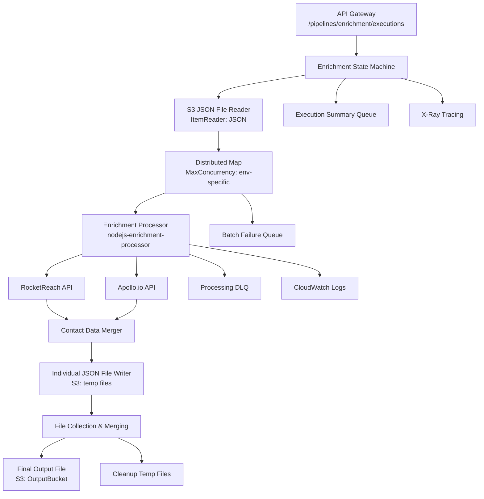

# Design Document

## Overview

The enrichment pipeline is a specialized contact data enhancement workflow that integrates with the existing SAM data processing platform. It processes JSON files containing contact data from the ingestion pipeline output, enriches records with additional emails and phone numbers through parallel API calls to RocketReach and Apollo.io, and outputs consolidated enriched datasets.

This pipeline extends the platform's multi-pipeline architecture by adding a new Step Functions state machine and Lambda function while reusing existing infrastructure patterns, API Gateway integration, and error handling mechanisms.

## Steering Document Alignment

### Technical Standards (tech.md)

The design follows all documented technical patterns and standards:

- **AWS Serverless Architecture**: Uses AWS SAM, Lambda (Node.js 20.x), Step Functions, S3, API Gateway, SQS, CloudWatch, and X-Ray
- **Multi-Environment Support**: Configurable resources per environment (dev/staging/production)
- **Environment-Specific Settings**: Memory (512MB dev/staging, 1024MB production), timeouts, concurrency limits
- **Security & Compliance**: IAM least privilege, Parameter Store for API keys, HTTPS/TLS, S3 encryption
- **Performance & Scalability**: Distributed processing, auto-scaling Lambda, configurable concurrency
- **Monitoring & Observability**: CloudWatch logs, X-Ray tracing, dead letter queues

### Project Structure (structure.md)

Implementation will follow established project organization conventions:

- **Function Organization**: New `nodejs-enrichment-processor` function in `functions/` directory
- **State Machine Organization**: New `enrichment_pipeline.asl.json` in `statemachine/` directory  
- **Naming Conventions**: Follow `{language}-{purpose}-{type}` pattern for functions
- **Infrastructure Patterns**: SAM template resource definitions with proper IAM policies
- **Error Handling Patterns**: Dead letter queue integration and structured logging
- **Testing Organization**: Unit and integration tests following established patterns

## Code Reuse Analysis

### Existing Components to Leverage

- **OUTPUT_DATA_STRUCTURE**: Reuse exact data structure from `/functions/nodejs-merge-csv-data/src/output_data_structure.mjs`
- **Deduplication Logic**: Leverage patterns from `nodejs-merge-csv-data` for email/phone deduplication
- **Batch Processing Patterns**: Reuse ItemBatcher structure and event handling from `nodejs-standardization`
- **S3 Integration**: Utilize S3Client patterns from existing functions (GetObject, PutObject, DeleteObjects)
- **Error Handling**: Apply structured logging and error patterns from existing Lambda functions
- **Environment Validation**: Use configuration validation patterns from existing functions

### Integration Points

- **API Gateway**: Extend existing IngestionApi with new `/pipelines/enrichment/executions` path
- **Step Functions**: Create new state machine following distributed map pattern from `ingestion_pipeline.asl.json`
- **Dead Letter Queues**: Integrate with existing `ProcessingDeadLetterQueue` and `BatchFailureQueue`
- **S3 Buckets**: Use existing `InputBucket` and `OutputBucket` with environment-specific naming
- **CloudWatch Logs**: Integrate with existing log retention and monitoring infrastructure

## Architecture

The enrichment pipeline follows the same distributed processing architecture as the ingestion pipeline with specialized components for contact data enrichment through third-party APIs.



## Components and Interfaces

### Enrichment Processor Lambda Function
- **Purpose:** Enriches individual contact records with additional emails and phones via parallel API calls
- **Interfaces:** 
  - Input: Batch of contact records in OUTPUT_DATA_STRUCTURE format
  - Output: Array of enriched contact records with individual JSON files written to S3
- **Dependencies:** 
  - RocketReach API (stored in Parameter Store: /enrichment/rocketreach-api-key)
  - Apollo.io API (stored in Parameter Store: /enrichment/apollo-api-key)
  - S3 for temporary file storage with structured naming: `temp/{executionId}/{batchId}/{recordId}.json`
- **Rate Limiting:** Implement 10 requests/second for RocketReach, 5 requests/second for Apollo.io
- **Reuses:** Batch processing patterns, S3Client integration, error handling patterns from nodejs-standardization

### Enrichment State Machine
- **Purpose:** Orchestrates the enrichment workflow using distributed map processing
- **Interfaces:**
  - Input: `{bucket, key, campaign_id}` from API Gateway
  - Output: Execution status and results
- **Dependencies:** Enrichment Processor Lambda, S3 buckets, SQS queues
- **Reuses:** Distributed map pattern, error handling states, execution summary logic

### API Gateway Integration
- **Purpose:** Provides REST endpoint for triggering enrichment pipeline executions
- **Interfaces:**
  - Endpoint: `POST /pipelines/enrichment/executions`
  - Input: `{Bucket, Key, campaign_id}`
  - Output: `{executionArn, startDate}`
- **Dependencies:** Existing IngestionApi Gateway
- **Reuses:** API Gateway configuration, CORS settings, authentication patterns

### File Merging Component
- **Purpose:** Consolidates individual enriched JSON files into final output
- **Interfaces:**
  - Input: Array of temporary file locations
  - Output: Single merged JSON file in OutputBucket
- **Dependencies:** S3Client for file operations
- **Reuses:** File merging logic from `nodejs-merge-csv-data`, deduplication patterns

## Data Models

### Input Data Model (Existing OUTPUT_DATA_STRUCTURE)
```javascript
{
  campaign_id: "string",
  commit_id: "string", 
  first_name: "string",
  last_name: "string",
  company_name: "string",
  job_title: "string",
  country: "string",
  linkedin_url: "string",
  address1: "string",
  address2: "string", 
  city: "string",
  state: "string",
  zip_code: "string",
  status: "string", // "created"
  emails: [
    {
      email: "string", // "john.doe@email.com"
      priority: 1
    }
  ],
  phones: [
    {
      phone: "string", // "+1-555-111111" 
      priority: 1
    }
  ]
}
```

### Enriched Data Model (Enhanced OUTPUT_DATA_STRUCTURE)
```javascript
{
  // All existing fields preserved
  ...OUTPUT_DATA_STRUCTURE,
  
  // Enhanced arrays with additional contacts
  emails: [
    { email: "original@email.com", priority: 1 },
    { email: "rocketreach@email.com", priority: 2 },
    { email: "apollo@email.com", priority: 3 }
  ],
  phones: [
    { phone: "+1-555-111111", priority: 1 },
    { phone: "+1-555-222222", priority: 1 }
  ],
  
  // Enrichment metadata
  enrichment_metadata: {
    enriched_at: "ISO-8601-timestamp",
    rocketreach_success: boolean,
    apollo_success: boolean,
    total_emails_added: number,
    total_phones_added: number
  }
}
```

### API Request/Response Models
```javascript
// API Request
{
  Bucket: "input-bucket-name",
  Key: "path/to/contacts.json", 
  campaign_id: "campaign-123"
}

// API Response
{
  executionArn: "arn:aws:states:ap-southeast-1:123456789012:execution:...",
  startDate: "2024-01-15T10:30:00.000Z"
}
```

## Error Handling

### Error Scenarios

1. **Third-Party API Failures**
   - **Handling:** Continue processing with available data, log API errors, set metadata flags
   - **User Impact:** Partial enrichment with original data preserved, clear error tracking

2. **Rate Limiting from APIs**
   - **Handling:** Implement exponential backoff, respect rate limits, queue failed requests
   - **User Impact:** Delayed processing but eventual completion, transparent retry mechanism

3. **Invalid Input Data**
   - **Handling:** Skip invalid records, log validation errors, continue with valid records
   - **User Impact:** Valid records processed successfully, invalid records flagged for review

4. **S3 File Operation Failures**
   - **Handling:** Retry with exponential backoff, send to DLQ if persistent, partial file recovery
   - **User Impact:** Temporary delays with automatic recovery, manual intervention for persistent failures

5. **Memory/Timeout Issues**
   - **Handling:** Optimize batch sizes, increase Lambda resources if needed, split large datasets
   - **User Impact:** Automatic resource scaling, consistent processing performance

6. **Network Connectivity Issues**
   - **Handling:** Circuit breaker patterns, graceful degradation, retry mechanisms
   - **User Impact:** Temporary processing delays with automatic recovery

## Testing Strategy

### Unit Testing
- **RocketReach API Integration**: Mock API responses, test success/failure scenarios, rate limiting
- **Apollo.io API Integration**: Mock API responses, test data extraction and transformation
- **Data Deduplication Logic**: Test email/phone duplicate detection and merging
- **File Processing Components**: Test S3 operations, temporary file handling, cleanup
- **Error Handling**: Test various failure scenarios and recovery mechanisms

### Integration Testing
- **End-to-End Pipeline Flow**: Test complete enrichment workflow from API trigger to final output
- **API Gateway Integration**: Test endpoint functionality, request/response handling
- **Step Functions Execution**: Test state transitions, error handling, execution summaries
- **Cross-Service Integration**: Test Lambda-S3-SQS interactions, monitoring integration

### End-to-End Testing
- **Real Data Processing**: Test with actual contact data files in various formats and sizes
- **Third-Party API Integration**: Test with sandbox/test environments of RocketReach and Apollo.io
- **Performance Testing**: Test with large datasets, concurrent executions, resource utilization
- **Multi-Environment Validation**: Test deployment and execution across dev/staging/production environments
- **Failure Recovery**: Test system behavior during various failure scenarios and recovery processes