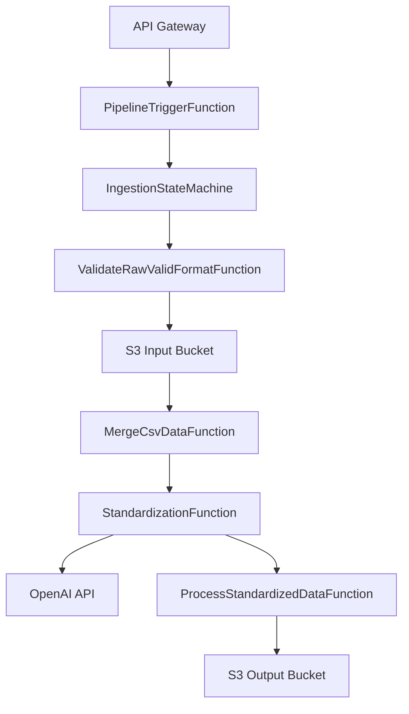
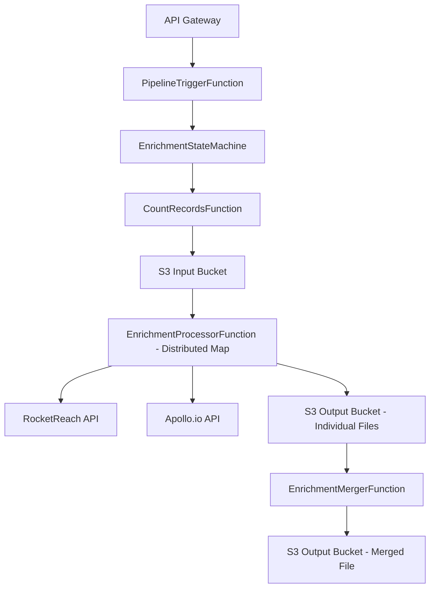

# SAM Learning Guide: Understanding Your Bullseye Data Pipeline

## Table of Contents
1. [SAM Template Structure](#sam-template-structure)
2. [Parameters & Configuration Loading](#parameters--configuration-loading)
3. [Conditions & Logic](#conditions--logic)
4. [Resources Overview](#resources-overview)
5. [Lambda Functions](#lambda-functions)
6. [Step Functions (State Machines)](#step-functions-state-machines)
7. [S3 Buckets](#s3-buckets)
8. [IAM Permissions](#iam-permissions)
9. [API Gateway](#api-gateway)
10. [Outputs](#outputs)
11. [Component Collaboration Flow](#component-collaboration-flow)
12. [Deployment Flow](#deployment-flow)

---

## SAM Template Structure

Your `template.yaml` follows the AWS SAM (Serverless Application Model) format:

```yaml
AWSTemplateFormatVersion: '2010-09-09'    # CloudFormation version
Transform: AWS::Serverless-2016-10-31      # SAM transform (enables SAM shortcuts)
Description: >                             # What this stack does
Parameters:                                # Input values for deployment
Conditions:                               # Logical conditions for conditional resources
Mappings:                                 # Static lookup tables
Globals:                                  # Default settings for all resources
Resources:                               # AWS resources to create
Outputs:                                 # Values to export after deployment
```

---

## Parameters & Configuration Loading

### Loading Order (Highest to Lowest Priority)

#### 1. Script Parameters (Direct Command Line)
```bash
./scripts/deploy.sh staging [openai-key] [rocketreach-key] [apollo-key]
```

#### 2. .env File Variables
```bash
# Loaded first in deploy.sh
OPENAI_API_KEY=sk-proj-...
ROCKETREACH_API_KEY=bf339eka...
INPUT_BUCKET_NAME=bullseye-pinpoint-staging-input-files
```

#### 3. Script Logic with Fallbacks
```bash
# deploy.sh cascading priority
OPENAI_API_KEY=${2:-$OPENAI_API_KEY}              # Script param OR .env
ROCKETREACH_API_KEY=${3:-${ROCKETREACH_API_KEY}}   # Script param OR .env OR empty
```

#### 4. samconfig.toml Base Configuration
```toml
[staging.deploy.parameters]
parameter_overrides = [
  "Environment=staging",
  "InputBucketName=bullseye-pinpoint-staging-input-files"  # Used if no script override
]
```

#### 5. Parameter Overrides (Final Override)
```bash
sam deploy --parameter-overrides \
    OpenAIApiKey=${OPENAI_API_KEY} \        # This OVERRIDES samconfig.toml
    RocketReachApiKey=${ROCKETREACH_API_KEY}
```

### Template Parameters Explained

```yaml
Parameters:
  Environment:                    # Deployment environment (dev/staging/production)
    Type: String
    Default: dev
    AllowedValues: [dev, staging, production]
    
  OpenAIApiKey:                  # Required API key for AI processing
    Type: String
    NoEcho: true                 # Hides value in CloudFormation console
    
  InputBucketName:               # Required S3 bucket name for input data
    Type: String
    Default: data-pipeline-input
    
  OutputBucketName:              # Required S3 bucket name for output data  
    Type: String
    Default: data-pipeline-output
    
  CreateInputBucket:             # Whether to create input bucket (auto-detected)
    Type: String
    Default: 'true'
    AllowedValues: ['true', 'false']
    
  CreateOutputBucket:            # Whether to create output bucket (auto-detected)
    Type: String  
    Default: 'true'
    AllowedValues: ['true', 'false']
```

---

## Conditions & Logic

Conditions allow conditional resource creation and logic branching:

```yaml
Conditions:
  ShouldCreateInputBucket: !Equals [!Ref CreateInputBucket, 'true']
  ShouldCreateOutputBucket: !Equals [!Ref CreateOutputBucket, 'true']
```

**How the simplified bucket logic works:**

### Bucket Creation Logic
- If `CreateInputBucket=true` → Creates input bucket with name from `InputBucketName`
- If `CreateInputBucket=false` → Uses existing bucket with name from `InputBucketName`
- Same logic applies to output bucket with `CreateOutputBucket` and `OutputBucketName`

### Smart Detection
The deployment script automatically detects if buckets exist:
```bash
if aws s3 ls "s3://${INPUT_BUCKET_NAME}" > /dev/null 2>&1; then
    CreateInputBucket=false  # Use existing bucket
else
    CreateInputBucket=true   # Create new bucket
fi
```

### Example: Your Current Setup
```bash
INPUT_BUCKET_NAME=bullseye-pinpoint-staging-input-files   # Bucket name to use
OUTPUT_BUCKET_NAME=bullseye-pinpoint-staging-output-files # Bucket name to use
CreateInputBucket=false   # Automatically set by deploy script (bucket exists)
CreateOutputBucket=false  # Automatically set by deploy script (bucket exists)
```

**Result**:
- Pipeline uses: `bullseye-pinpoint-staging-input-files` (existing bucket)
- Pipeline uses: `bullseye-pinpoint-staging-output-files` (existing bucket)
- Total buckets: **0 new buckets created** (uses existing ones)

---

## Resources Overview

### Resource Types in Your Template

| Resource Type | Count | Purpose |
|---------------|-------|---------|
| `AWS::Serverless::Function` | 9 | Lambda functions (data processing) |
| `AWS::Serverless::StateMachine` | 2 | Step Functions (workflow orchestration) |
| `AWS::S3::Bucket` | 0-2 | Data storage (conditionally created only if needed) |
| `AWS::Serverless::Api` | 1 | REST API endpoints |
| `AWS::SQS::Queue` | 2 | Dead letter queues (error handling) |
| `AWS::Logs::LogGroup` | 1 | Centralized logging |

---

## Lambda Functions

### Function Architecture

All functions share these settings (from `Globals`):
```yaml
Globals:
  Function:
    Runtime: nodejs20.x          # Node.js version
    Architectures: [x86_64]      # Processor architecture
    Timeout: !FindInMap [EnvironmentMap, !Ref Environment, LambdaTimeout]  # Environment-specific
    MemorySize: !FindInMap [EnvironmentMap, !Ref Environment, LambdaMemorySize]
    Tracing: Active              # X-Ray tracing enabled
```

### Individual Functions

#### 1. **ValidateRawValidFormatFunction**
- **Purpose**: Validates CSV input format against expected schema
- **Triggers**: Step Functions
- **S3 Access**: Read from input bucket
- **Code Location**: `functions/nodejs-validate-raw-valid-format/`

#### 2. **CountRecordsFunction** 
- **Purpose**: Counts total records in S3 files for progress tracking
- **Triggers**: Step Functions (both ingestion and enrichment)
- **S3 Access**: Read from input bucket
- **Code Location**: `functions/nodejs-count-records/`

#### 3. **MergeCsvDataFunction**
- **Purpose**: Merges processed CSV data from distributed map execution
- **Triggers**: Step Functions
- **S3 Access**: Read from input bucket, write to output bucket
- **Special**: Higher memory (512MB) and timeout (300s) for data processing
- **Code Location**: `functions/nodejs-merge-csv-data/`

#### 4. **StandardizationFunction**
- **Purpose**: Standardizes data using OpenAI API
- **Triggers**: Step Functions
- **S3 Access**: Read from input bucket
- **Environment Variables**: `OPENAI_API_KEY`
- **Code Location**: `functions/nodejs-standardization/`

#### 5. **ProcessStandardizedDataFunction**
- **Purpose**: Final processing and storage of standardized data
- **Triggers**: Step Functions
- **S3 Access**: Write to output bucket
- **Environment Variables**: `OUTPUT_BUCKET_NAME`, `BUCKET_NAME` (legacy compatibility)
- **Code Location**: `functions/nodejs-process-standardized-data/`

#### 6. **MergeCsvDataFunction**
- **Purpose**: Merges processed CSV data from distributed map execution
- **Triggers**: Step Functions
- **S3 Access**: Read from input bucket, write to output bucket
- **Environment Variables**: `INPUT_BUCKET_NAME`, `OUTPUT_BUCKET_NAME`, `OUTPUT_BUCKET`
- **Special**: Higher memory (512MB) and timeout (300s) for data processing
- **Code Location**: `functions/nodejs-merge-csv-data/`

#### 7. **EnrichmentProcessorFunction**
- **Purpose**: Enriches contact data with RocketReach and Apollo.io APIs
- **Triggers**: Step Functions (enrichment pipeline)
- **S3 Access**: Read from input bucket, write to output bucket
- **Environment Variables**: `INPUT_BUCKET_NAME`, `OUTPUT_BUCKET_NAME`, `BUCKET_NAME`, `ROCKETREACH_API_KEY`, `APOLLO_API_KEY`
- **Code Location**: `functions/nodejs-enrichment-processor/`

#### 8. **EnrichmentMergerFunction**
- **Purpose**: Merges individual enriched contact JSON files
- **Triggers**: Step Functions
- **S3 Access**: Read/write to output bucket
- **Environment Variables**: `OUTPUT_BUCKET_NAME`, `BUCKET_NAME` (legacy compatibility)
- **Code Location**: `functions/nodejs-enrichment-merger/`

#### 8. **PipelineTriggerFunction**
- **Purpose**: HTTP API endpoint to trigger any pipeline type
- **Triggers**: API Gateway
- **Returns**: Formatted response with execution details
- **Environment Variables**: `INGESTION_STATE_MACHINE_ARN`, `ENRICHMENT_STATE_MACHINE_ARN`
- **Code Location**: `functions/nodejs-pipeline-trigger/`

### Lambda Function Permissions

Each function has specific IAM permissions:

```yaml
Policies:
  - S3ReadPolicy:               # SAM policy template
      BucketName: !Ref InputBucketName
  - Statement:                  # Custom IAM policy
      - Effect: Allow
        Action:
          - kms:Decrypt         # For encrypted S3 objects
          - kms:GenerateDataKey # For writing encrypted objects
        Resource: "*"
```

---

## Step Functions (State Machines)

Step Functions orchestrate Lambda functions in workflows.

### 1. **IngestionStateMachine**
- **Purpose**: Orchestrates the data ingestion and standardization pipeline
- **Definition File**: `statemachine/ingestion_pipeline.asl.json`
- **Functions Used**: ValidateRawValidFormat → MergeCsvData → Standardization → MappingRawValidInput → ProcessStandardizedData
- **Trigger**: API Gateway or direct invocation

### 2. **EnrichmentStateMachine**
- **Purpose**: Orchestrates the contact enrichment pipeline
- **Definition File**: `statemachine/enrichment_pipeline.asl.json`
- **Functions Used**: CountRecords → EnrichmentProcessor (distributed map) → EnrichmentMerger
- **Trigger**: API Gateway or direct invocation

### Step Function Permissions

```yaml
Policies:
  - LambdaInvokePolicy:         # Can invoke Lambda functions
      FunctionName: !Ref CountRecordsFunction
  - Statement:                  # Custom permissions
      - Effect: Allow
        Action: [s3:GetObject, s3:ListBucket]  # Direct S3 access
        Resource: [bucket-arn, bucket-arn/*]
      - Effect: Allow
        Action: [kms:Decrypt, kms:GenerateDataKey]  # For encrypted S3
        Resource: "*"
```

---

## S3 Buckets

### Simplified Conditional Bucket System

Your template uses a **simplified conditional bucket system** that can either use existing S3 buckets or create new ones based on deployment configuration.

### Current Bucket Logic & Conditions

```yaml
Conditions:
  # Bucket creation logic: Only create buckets if they don't already exist
  ShouldCreateInputBucket: !Equals [!Ref CreateInputBucket, 'true']
  ShouldCreateOutputBucket: !Equals [!Ref CreateOutputBucket, 'true']
```

### Bucket Resources

```yaml
# Input bucket - only created if CreateInputBucket=true
InputBucket:
  Type: AWS::S3::Bucket
  Condition: ShouldCreateInputBucket
  Properties:
    BucketName: !Ref InputBucketName

# Output bucket - only created if CreateOutputBucket=true  
OutputBucket:
  Type: AWS::S3::Bucket
  Condition: ShouldCreateOutputBucket
  Properties:
    BucketName: !Ref OutputBucketName
```

### How Pipeline Bucket Selection Works

The pipeline uses the bucket names directly from parameters:

```yaml
# In Lambda environment variables:
INPUT_BUCKET_NAME: !Ref InputBucketName     # Direct bucket name reference
OUTPUT_BUCKET_NAME: !Ref OutputBucketName   # Direct bucket name reference
BUCKET_NAME: !Ref OutputBucketName          # Legacy compatibility
```

### Bucket Usage Scenarios

#### Scenario 1: Use Existing Buckets (Your Current Setup)
```bash
# .env file:
INPUT_BUCKET_NAME=bullseye-pinpoint-staging-input-files
OUTPUT_BUCKET_NAME=bullseye-pinpoint-staging-output-files
```

**Deploy script automatically detects** existing buckets and sets:
- `CreateInputBucket=false`
- `CreateOutputBucket=false`

**Result**: Uses existing buckets, creates **no new buckets**

#### Scenario 2: Create New Buckets
```bash
# .env file with non-existing bucket names:
INPUT_BUCKET_NAME=my-new-input-bucket
OUTPUT_BUCKET_NAME=my-new-output-bucket
```

**Deploy script detects** buckets don't exist and sets:
- `CreateInputBucket=true`
- `CreateOutputBucket=true`

**Result**: Creates **2 new buckets**:
- `my-new-input-bucket`
- `my-new-output-bucket`

#### Scenario 3: Mixed Scenario (One Existing, One New)
```bash
# .env file:
INPUT_BUCKET_NAME=existing-input-bucket      # Already exists in AWS
OUTPUT_BUCKET_NAME=new-output-bucket         # Doesn't exist yet
```

**Deploy script sets**:
- `CreateInputBucket=false` (uses existing)
- `CreateOutputBucket=true` (creates new)

**Result**: Uses 1 existing bucket, creates 1 new bucket

### Automatic Bucket Detection

The deployment script (`deploy.sh`) automatically detects bucket existence:

```bash
# Check if buckets exist in AWS
if aws s3 ls "s3://${INPUT_BUCKET_NAME}" > /dev/null 2>&1; then
    INPUT_BUCKET_EXISTS="true"
    PARAM_OVERRIDES="${PARAM_OVERRIDES} CreateInputBucket=false"
else
    PARAM_OVERRIDES="${PARAM_OVERRIDES} CreateInputBucket=true"
fi
```

### Template Output Logic

The outputs show which buckets are being used:

```yaml
Outputs:
  InputBucketName:
    Description: "Name of the S3 input bucket (existing or created)"
    Value: !Ref InputBucketName
  
  OutputBucketName:
    Description: "Name of the S3 output bucket (existing or created)"
    Value: !Ref OutputBucketName
```

### Why This Simplified System?

This design provides **simplicity and reliability**:

1. **No Complexity**: Single bucket names, no conditional logic in Lambda functions
2. **Automatic Detection**: Deploy script handles bucket existence automatically  
3. **Error Prevention**: Avoids "AlreadyExists" errors by detecting existing buckets
4. **Environment Compatibility**: Works with both existing and new bucket setups
5. **Cost Efficiency**: Only creates buckets when needed

---

## IAM Permissions

### Permission Layers

#### 1. **SAM Policy Templates** (Convenient Shortcuts)
```yaml
- S3ReadPolicy:
    BucketName: my-bucket-name        # Grants s3:GetObject, s3:ListBucket
- S3WritePolicy:
    BucketName: my-bucket-name        # Grants s3:PutObject, s3:DeleteObject
```

#### 2. **Custom IAM Statements** (Explicit Permissions)
```yaml
- Statement:
    - Effect: Allow
      Action: [kms:Decrypt, kms:GenerateDataKey]
      Resource: "*"                   # Access to KMS for encrypted S3 objects
```

### Why KMS Permissions Are Needed

Your S3 buckets are encrypted with KMS:
```bash
aws s3api get-bucket-encryption --bucket bullseye-pinpoint-staging-input-files
# Shows: "SSEAlgorithm": "aws:kms"
```

When Lambda/Step Functions access encrypted S3 objects, they need:
- `kms:Decrypt` - To read encrypted objects
- `kms:GenerateDataKey` - To write encrypted objects

---

## API Gateway

### API Structure

```yaml
IngestionApi:
  Type: AWS::Serverless::Api
  Properties:
    StageName: !Ref Environment       # Creates stage: dev/staging/production
    Cors:                            # Enable cross-origin requests
      AllowMethods: "'GET,POST,OPTIONS'"
      AllowOrigin: "'*'"
```

### API Endpoints

The `PipelineTriggerFunction` creates these endpoints:

| Method | Path | Purpose |
|--------|------|---------|
| POST | `/pipelines/ingestion/executions` | Trigger ingestion pipeline |
| POST | `/pipelines/enrichment/executions` | Trigger enrichment pipeline |

**Example URLs:**
- `https://abc123.execute-api.us-east-1.amazonaws.com/staging/pipelines/ingestion/executions`
- `https://abc123.execute-api.us-east-1.amazonaws.com/staging/pipelines/enrichment/executions`

---

## Outputs

Outputs export values for other stacks or external use:

```yaml
Outputs:
  InputBucketName:
    Description: "Name of the S3 input bucket (existing or created)"
    Value: !Ref InputBucketName       # Direct bucket name reference
    Export:
      Name: !Sub "${AWS::StackName}-InputBucket"  # Cross-stack reference name
  
  OutputBucketName:
    Description: "Name of the S3 output bucket (existing or created)"
    Value: !Ref OutputBucketName      # Direct bucket name reference
    Export:
      Name: !Sub "${AWS::StackName}-OutputBucket" # Cross-stack reference name
```

---

## Component Collaboration Flow

### Data Ingestion Pipeline



### Data Enrichment Pipeline



### Component Interactions

#### 1. **API Gateway → Lambda**
- HTTP requests trigger `PipelineTriggerFunction`
- Function validates request and starts appropriate Step Function

#### 2. **Step Functions → Lambda**
- State Machines orchestrate Lambda function execution
- Pass data between functions via Step Function state
- Handle errors and retries automatically

#### 3. **Lambda → S3**
- Functions read input data from S3 input bucket
- Functions write processed data to S3 output bucket
- KMS permissions required for encrypted buckets

#### 4. **Lambda → External APIs**
- `StandardizationFunction` calls OpenAI API
- `EnrichmentProcessorFunction` calls RocketReach and Apollo APIs
- API keys passed via environment variables

#### 5. **Error Handling**
- Dead Letter Queues capture failed executions
- CloudWatch Logs capture function outputs
- X-Ray tracing tracks request flows

---

## Deployment Flow

### Step-by-Step Deployment Process

#### 1. **Pre-Deployment**
```bash
./scripts/deploy.sh staging
```

#### 2. **Environment Loading**
```bash
# deploy.sh loads .env file
source .env
# Now OPENAI_API_KEY, ROCKETREACH_API_KEY, etc. are available
```

#### 3. **Validation**
```bash
sam validate --region us-east-1
# Checks template.yaml syntax and references
```

#### 4. **Build**
```bash
sam build
# Compiles Lambda functions and dependencies
# Creates .aws-sam/build/ directory
```

#### 5. **Deploy**
```bash
sam deploy --config-env staging --parameter-overrides \
    Environment=staging \
    OpenAIApiKey=$OPENAI_API_KEY \           # From .env
    RocketReachApiKey=$ROCKETREACH_API_KEY \  # From .env
    InputBucketName=bullseye-pinpoint-staging-input-files  # From samconfig.toml
```

#### 6. **CloudFormation Processing**
- Creates/updates CloudFormation stack
- Processes conditions (CreateInputBucket=false)
- Creates resources in dependency order:
  1. IAM roles
  2. S3 buckets (conditionally)
  3. Lambda functions
  4. Step Functions
  5. API Gateway
  6. Outputs

#### 7. **Post-Deployment**
```bash
# deploy.sh shows stack information and endpoints
aws cloudformation describe-stacks --stack-name bullseye-data-pipeline-staging
```

### Environment-Specific Configurations

The template uses `Mappings` for environment-specific settings:

```yaml
Mappings:
  EnvironmentMap:
    staging:
      LambdaMemorySize: 512        # More memory than dev
      LambdaTimeout: 120           # Longer timeout than dev
      StepFunctionsConcurrency: 500 # Higher concurrency
    production:
      LambdaMemorySize: 1024       # Maximum memory
      LambdaTimeout: 300           # Maximum timeout
      StepFunctionsConcurrency: 1000 # Maximum concurrency
```

**Usage in template:**
```yaml
MemorySize: !FindInMap [EnvironmentMap, !Ref Environment, LambdaMemorySize]
# staging → 512MB, production → 1024MB
```

---

## Key Learning Points

### 1. **SAM vs CloudFormation**
- SAM is a simplified syntax for serverless applications
- `AWS::Serverless::Function` → creates Lambda + IAM role + triggers
- `AWS::Serverless::Api` → creates API Gateway + stages + CORS
- Transform processes SAM syntax into full CloudFormation

### 2. **Parameter Precedence**
- Script parameters > .env variables > samconfig.toml defaults
- `--parameter-overrides` always wins over samconfig.toml values

### 3. **Conditional Logic**
- Use conditions for optional resource creation
- `!If [ConditionName, ValueIfTrue, ValueIfFalse]`
- Prevents resource conflicts when using existing resources

### 4. **Permissions Strategy**
- SAM policy templates for common patterns (S3ReadPolicy, etc.)
- Custom IAM statements for specific needs (KMS, cross-service access)
- Principle of least privilege - only grant needed permissions

### 5. **State Management**
- Step Functions manage complex workflows
- Pass data between Lambda functions via state
- Built-in error handling and retry logic

### 6. **Environment Isolation**
- Use Mappings for environment-specific configurations
- Separate stacks per environment (dev, staging, production)
- Different resource sizes and timeouts per environment

---

This guide should help you understand how all the components work together in your SAM application. Each piece has a specific purpose and they collaborate to create a robust, scalable data processing pipeline! 🚀